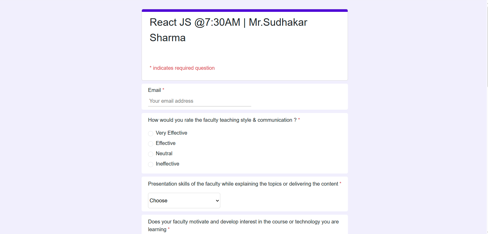
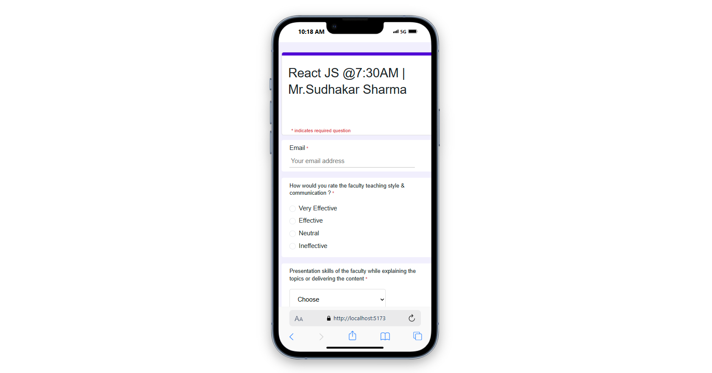

# ⭐ Feedback Form — React + Formik

This is a fully responsive **feedback form** built with **React.js**, **Formik**, and **Yup** for validation. It includes various input types such as text fields, select dropdowns, radio buttons, and a dynamic star rating system.

---

## 🧰 Tech Stack

- **React.js** (Functional Components + Hooks)
- **Formik** (Form state management)
- **Yup** (Validation schema)
- **Bootstrap 5** (Styling and layout)
- **Bootstrap Icons** (Star rating)

---

## 📱 Features

- ✅ Responsive design (mobile-first)
- ✅ Vertical star rating on mobile
- ✅ Formik-powered form state
- ✅ Yup validation with error messages
- ✅ Reset / Clear form functionality
- ✅ Clean UI with structured sections
- ✅ All form data logged on submit (can be connected to backend)

---

## 📸 Screenshots

| Desktop View | Mobile View |
|--------------|-------------|
|  |  |


---

##  Live Demo
You can try the live demo of the feedback form here:
[Live Demo](https://sachinparshetti.github.io/Feedback-Form/)

## 🏁 Getting Started

### 1. Clone the repository

```bash
git clone https://github.com/YOUR_USERNAME/feedback-form-react.git
cd feedback-form-react
2. Install dependencies
bash
Copy
Edit
npm install
3. Start the development server
bash
Copy
Edit
npm start
The app will run at: http://localhost:3000

⚙️ File Structure
css
Copy
Edit
src/
│
├── components/
│   └── FeedbackForm2.jsx      
│
├── app.css                  
├── App.js
└── index.js
✨ Customization
✅ To change questions, modify them directly in FeedbackForm2.jsx.

✅ To connect to a backend, replace the console.log(values) in the onSubmit function with an API call using axios or fetch.

✅ You can also integrate Firebase, MongoDB, or any other service to persist responses.

🚀 Deployment
You can deploy the project easily using:

Netlify

Vercel

GitHub Pages (via gh-pages)

📌 TODOs / Future Enhancements
 Integrate with a backend or Google Sheets

 Add user authentication

 Export responses as CSV

 Admin dashboard to review feedback


## 🧑‍💻 Author

**Sachin Parashetti**  
🔗 [GitHub @SachinParashetti](https://github.com/SachinParashetti)  
🔗 [LinkedIn: sachin-parashetti](https://www.linkedin.com/in/sachin-parashetti-99b255259)